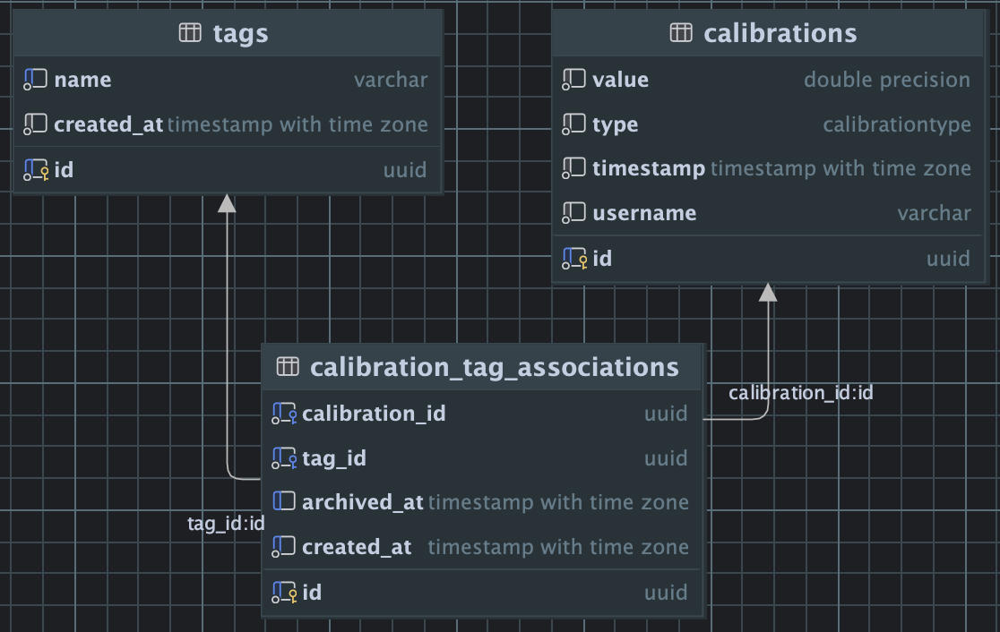

# calibration-service

## Pre-requisites

- **Python** 3.12 or higher, [link][python]
- **uv** for python runtime and dependency management, [link][uv]
- **Docker Desktop** or Docker Compose capable tool (e.g. [podman desktop][podman] or [rancher desktop][rancher])
- **Node.js** for Pyright pre-commit hook execution, [link][pyright]


## Quick Start

### A) Online Deployment

- [Live Docs][live-docs] - GitHub pages hosted docs site making reading these docs a bit easier
- ~~[Live Site][live-site] - deployed application~~ # TODO: (future)

### (B) Offline Deployment Options

#### Prepare

**Download source:**

- Clone the repository, and go into the project directory `calibration-service`

**Avoid port conflicts:**

- `5777` - port of dev db
- `5778` - port of test db
- `8777` - port of FastAPI web driver

_Troubleshooting: Verify if a local service is listening by run `lsof -i :<port>` to see binding. If
found, `pkill -9 <PID>` to stop_

#### Containerized Deployment

1. Start Docker Desktop
2. Run Docker compose: pull images, builds, runs migrations, seeds and starts the container
   ```bash
   docker compose up
   ```
3. Go to [localhost:8777/docs](http://localhost:8777/docs) - OpenAPI spec to explore the api
4. (Optional) Open online documentation

_Note: for local deployment see [DEVELOPER](docs/DEVELOPER.md#running-on-localhost-without-docker-compose)_

## Cleanup

   ```bash
   docker compose down -v --rmi local
   ```

## Points of Interest

- [OpenApi Specification](http://localhost:8777/docs)
- [Calibration Repository (Postgres)](src/infrastructure/repositories/calibration_repository/postgres_repository.py)
- [Tag Repository (Postgres)](src/infrastructure/repositories/tag_repository/postgres_repository.py)
- [Calibration Routes (FastAPI)](src/drivers/rest/routers/calibration_router.py)
- [Tag Routes (FastAPI)](src/drivers/rest/routers/tag_router.py)
- [Calibration Api integration tests](tests/integration/drivers/rest/test_calibration_api.py)
- [Tagging Api integration tests](tests/integration/drivers/rest/test_tagging_api.py)

# Testing and validating system functionality

## End to End

With the project up and running use docker cli to execute the e2e tests in a different terminal
- [test_api_use_cases_e2e.py](tests/e2e/test_api_use_cases_e2e.py) take home assignment uc1-4 tests
- [test_tag_archiving_e2e.py](tests/e2e/test_tag_archiving_e2e.py) take home assignment uc5

   ```bash
   docker compose exec web uv run test_e2e
   ```

## Component Integration

   ```bash
   docker compose exec web uv run pytest tests/integration/drivers/rest
   ```

   ```bash
   docker compose exec web uv run pytest tests/integration/repositories
   ```

## Unit

   ```bash
   docker compose exec web uv run test
   ```

## ERD



## Next Steps

_Where I would want to continue to refine the system._

- **Users:** a `users` table to replace the _"username"_ on a `CalibrationAssociation`, and allow for something to bring
  a trackable Actor into the system
- **ISessions:** bring Session up into the Entity layer and removing the third-party reliance on SqlAlchemy's
  `AsyncSession`
- **IAuthentication Service:** that encapsulates `sign_up`, `sign_in`, and `sign_out` use cases and helps demonstrate
  how easy swapping out one oidc provider for another could be
- **Instrumentation/Monitoring:** wrappers to monitor and benchmark each system interaction as it goes through the
  boundaries of the Clean Architecture surrounds all

## Inspiration

I’ve been eager to try Clean Architecture, so I was excited to take this project as a chance to dive in outside of work.
In day-to-day development, we often have to stay laser-focused on shipping just enough—so it was refreshing to explore a
more intentional, scalable structure. I started by defining the use case and interfaces, then adapted a MongoDB
repository based on [shaliamekh][mongo-repo], and later swapped in a PostgreSQL version without touching the core logic.
That flexibility—being able to change out infrastructure without rewriting business rules—really drove home the value of
this approach. Clean Architecture made it easy to innovate at the edges while keeping the core rock-solid. If you’re
curious about the structure, I nerded out a bit more in the [ARCHITECTURE](docs/ARCHITECTURE.md) section.

## Developer Experience

Coming from a Node.js and TypeScript background, I was initially skeptical about Python—especially around tooling, type
safety, and developer ergonomics. But this project turned out to be a crash course in how far the Python ecosystem has
come. Tools like uv and pyproject.toml gave me the dependency management experience I’d been missing, and enabling
Pyright in PyCharm brought back the type hints, squiggles, and Intellisense I rely on daily. Once dialed in, my Python
dev environment felt just as powerful—if not more streamlined—than my usual setup.

On the infrastructure side, working with Terraform reminded me how much I enjoy bridging systems design with application
code—something I previously explored through AWS CDK. This project showed me that clean architecture, code organization,
and system-level thinking (along with solid tooling habits) are transferable across languages. And in the age of AI,
where every developer effectively has a supercomputer at their side, the ability to learn quickly and structure ideas
well has never been more important. It’s not just about syntax—it’s about creating an environment that helps you think
clearly and ship confidently.

## Additional Documentation

- [Developer Guide](docs/DEVELOPER.md) - Day-to-day development workflows
- [Database Management](docs/DATABASE.md) - Detailed information about database management operations
- [Architecture Inspiration](docs/ARCHITECTURE.md) - System design and software architecture inspiration
- [Testing Approach](docs/TESTS.md) - How to execute project tests and the packages used
- [CI/CD](docs/WORKFLOWS.md) - Description of CI/CD workflows

## License

[License details here]


<!-- link helpers below -->

[python]: https://www.python.org/downloads/

[uv]: https://docs.astral.sh/uv/

[pyright]: https://microsoft.github.io/pyright/#/installation

[podman]: https://podman-desktop.io/

[rancher]: https://rancherdesktop.io/

[live-docs]: https://el-besto.github.io/calibration-service/welcome

[live-site]: https://calibration-service.fly.dev/docs

[mongo-repo]: https://github.com/shaliamekh/clean-architecture-fastapi/blob/main/src/adapters/repositories/auction_repository/mongodb_repository.py
